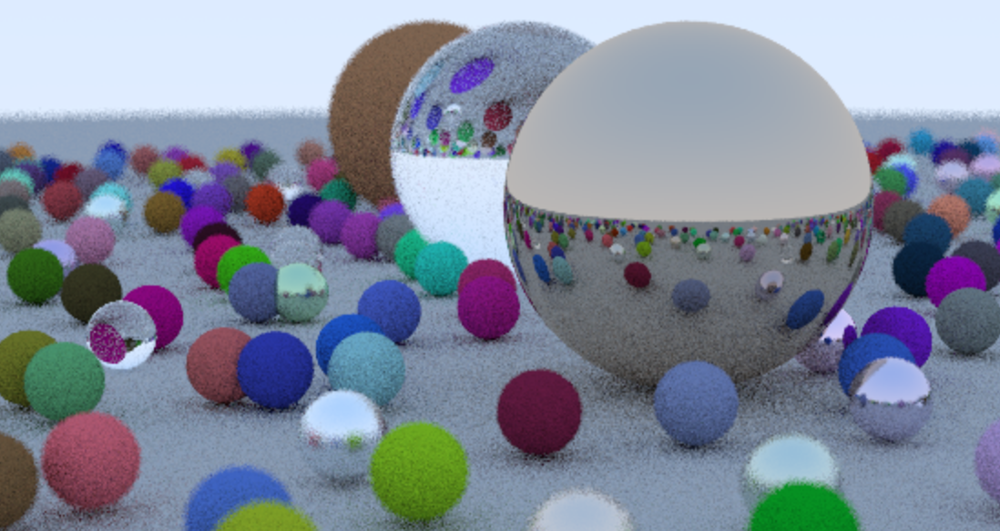

## Basic Ray Tracing Framework is fnished.

## Required ML pack library is installed and verified successfully.
## Next Move:
1. Building BVH hierachy based on this given picture.
2. Timing different sepheres rendering time.
3. Find an ML model is potentially useful for this BVH traverse acceleration.
